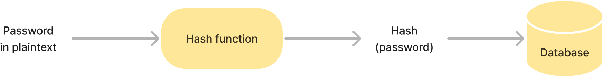
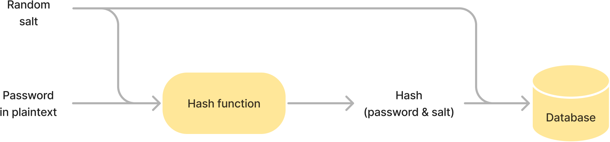

# How to securely store passwords in a database?

Passwords must never be stored in clear text in the database. If they were, attackers would be able to steal them if the database ever gets compromised.

To avoid this, two actions are necessary to store a password securely: hashing and salting.

## Hashing

A hash function is a one-way function that maps one value to another value of fixed size. Secure hash functions are unidirectional: it is not possible to "decrypt" the generated hash and get the original value. They are used to generate password hashes.

When a user first registers for the application, his or her password is hashed and the result is stored in the database. Then, when the user tries to log in again, the submitted password is also hashed and the result is compared to the value stored in the database. If the values are equal, the password is correct. If not, the password is incorrect. This way, the password is not stored in the database in clear text and if the database is compromised, an attacker will not be able to read the passwords.



_Note: Not all hash algorithms are secure for storing passwords. In particular, MD5 or SHA-1 are not suitable because the original password can potentially be guessed by studying the hash. According to [OWASP](https://owasp.org/), the currently secure hash functions for storing passwords are Argon2id, bcrypt, scrypt and PBKDF2._

## Salting

Hashing passwords is however not enough. An attacker can defeat one-way hashes with pre-computation attacks.

If an attacker pre-computes hashes of common passwords and builds what is called a _rainbow table_, they will be able to retrieve some of the original passwords by comparing the table’s hashes with those stored in the database.

To avoid this, a random string, a _salt_, can be generated for each password and used during the hashing process. In this case, not only does the hash function take the password as input, but it also takes the salt. This implies that two identical passwords will result in a different hash because they will have a different randomly generated salt used to generate the hash.



More precisely, when a user subscribes to the application for the first time, a salt is generated. This salt and the password are next combined and hashed. The result is stored in the database along with the salt. Then, when the user tries to log in again, the salt is retrieved from the database and combined with the submitted password to be hashed. The resulted hash is then compared to the value stored in the database.

In this way, if an attacker wants to pre-computes hashes, they will have to pre-compute a hash table for each salt (i.e, each password stored in the database), which considerably increases the required capacity and computing time, making password theft more difficult.

When properly implemented and with the right algorithms, these two techniques, salting and hashing, thus allow passwords to be securely stored in the database.

## Bonus: algorithm rotation

Usually, the salt and the hash are not the only two values that are stored in the database. The algorithm and some additional information are also present with them.

For example, in the case of the Django framework, this is how a password stored in the database might look like:

```
pbkdf2_sha256$150000$B6U8ZKsV963hFZLlsGiOuQ==$ZnaWnEOVWbKQTMdRi4AJ3KrDXeDps7BqKmUIOfXJVVw=
```

It consists of four parts, each delimited by the `$` character:

- the name of the algorithm,
- the number of iterations used by the PBKDF2 algorithm,
- the salt
- and the hash.

Storing this information is useful in case the number of iterations becomes insufficient (due to increased computational capacity) or if the algorithm is deprecated in favor of more secure ones. In this case, an algorithm rotation can be performed.

When a user logs in, the application retrieves the algorithm and its arguments (the number of iterations in this case) from the database. If the algorithm and arguments are considered safe, they are used to hash the submitted password and test if it is valid as usual.

If the algorithm and arguments are not up to date, the framework performs an additional step. After the password is verified and approved, a new hash is generated with the latest security guidelines and replaces the one previously stored in the database. The algorithm information is also updated.

This way, it is ensured that as many passwords as possible in the database are hashed with the latest security recommandations.
