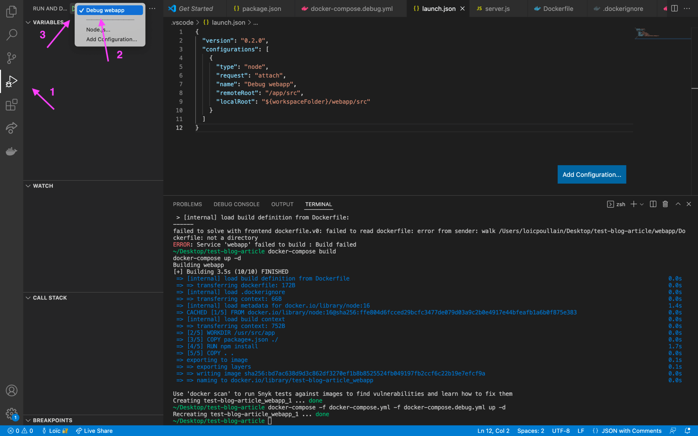

# How to use VSCode debugger with multiple Docker services

In my company, we use Docker and Docker Compose to run our Node.js services locally. Recently, I needed to configure and run the VSCode debugger on some of these services to debug a feature. There are a few things to know to achieve this, which I will share in this article with some basic examples.

Before we start, here are the points that will serve as a guideline in this tutorial:

- We want to keep using Docker and Docker compose to run our services, so that we have the proper environment for each of these services (environment variables, etc).
- We do not want to touch the current _docker-compose.yml_ which could, potentially, be used in the future to deploy our services in production.

## The Sample Application

Let’s start by creating a first service. It is a simple web server that concatenates two strings, a first name and a last name, and returns the result. This service will live in a _webapp/_ directory at the root of the project.

### The Node.JS code

_webapp/package.json_

```json
{
  "name": "webapp",
  "scripts": {
    "start": "node src/server.js"
  },
  "dependencies": {
    "express": "^4.16.1"
  }
}
```

_webapp/src/server.js_

```js
const express = require("express");
const app = express();

app.get("/fullname", (req, res) => {
  const firstName = req.query.firstNme;
  const lastName = req.query.lastName;
  res.send(`${firstName} ${lastName}`);
});

app.listen(8080, () => console.log("Listening on port 8080..."));
```

_webapp/Dockerfile_

```dockerfile
FROM node:16

WORKDIR /usr/src/app

COPY package*.json ./

RUN npm install
COPY . .

EXPOSE 8080
CMD [ "node", "src/server.js" ]
```

_webapp/.dockerignore_

```sh
node_modules
npm-debug.log
```

### The Docker configuration

Now that the application code is written and the _Dockerfile_ created, we can add a _docker-compose.yml_ file at the root of the project.

_docker-compose.yml_

```yaml
services:
  webapp:
    build: ./webapp
    ports:
      - "127.0.0.1:8080:8080"
```

Let’s start the service.

```sh
docker-compose build
docker-compose up -d
```

If you go to [http://localhost:8080/fullname?firstName=Foo&lastName=Bar](http://localhost:8080/fullname?firstName=Foo&lastName=Bar), you should see the string `undefined Bar`, which is the unexpected behavior we will debug.

## Debugging the Application in Docker with VSCode

### The debugger command

To allow the future VSCode debugger to attach to the Node service, we need to specify it when we start the process by adding the `--inspect` flag.

_webapp/package.json_

```json
{
  "name": "webapp",
  "scripts": {
    "start": "node src/server.js",
    "start:docker:debug": "node --inspect=0.0.0.0:9229 src/server.js"
  },
  "dependencies": {
    "express": "^4.16.1"
  }
}
```

_Simply using `--inspect` or `--inspect=127.0.0.1:9229` is not sufficient here because we need the `9229` port to be accessible from outside the service, which is allowed by the `0.0.0.0` address. So this command should only be used when you run the debugger in a Docker service. Otherwise, you would expose the port and the debugger to anyone on the Internet._

### The Docker configuration

Following our guideline, we do not modify the initial _docker-compose.yml_ but create a second one that extends the first one. We will use the [`f` flag](https://docs.docker.com/compose/reference/#use–f-to-specify-name-and-path-of-one-or-more-compose-files) of the `docker-compose` CLI to use them both.

_docker-compose.debug.yml_

```yaml
services:
  webapp:
    command: ["npm", "run", "start:docker:debug"]
    ports:
      - "127.0.0.1:8080:8080"
      - "127.0.0.1:9229:9229"
```

Then, to restart the service with debug mode enabled, you can use this command:

```sh
docker-compose build
docker-compose -f docker-compose.yml -f docker-compose.debug.yml up -d
```

The service is now ready to be attached to the VSCode debugger.

### Running the debugger with VSCode

At the root of your project, create a new directory _.vscode_ and add the following configuration file.

_.vscode/launch.json_

```json
{
  "version": "0.2.0",
  "configurations": [
    {
      "type": "node",
      "request": "attach",
      "name": "Debug webapp",
      "remoteRoot": "/app/src",
      "localRoot": "${workspaceFolder}/webapp/src"
    }
  ]
}
```

When adding a breakpoint, the `remoteRoot` and `localRoot` properties will match the file’s position in the VSCode environment and its location in the Docker service file system.

You can now start the debugger on the `webapp` service. Open the debugging panel and select the _Debug webapp_ option. Then click on the play button.



The debugger is started.


Add a breakpoint on line 6 and then go to [http://localhost:8080/fullname?firstName=Foo&lastName=Bar](http://localhost:8080/fullname?firstName=Foo&lastName=Bar).


The debugger stops on line 6 and we can see that the variable `firstName` is undefined. The problem comes from line 5 where this is a typo on the `firstName` parameter name.

To close the debugger, click on the button with a red square.

## Debugging Multiple Docker Services

### The Node.JS micro-service

To take this a step further, we will add another service, named `micro-service`, which will be called by `webapp`.

First, copy and paste the contents of the _webapp_ directory into another directory named _micro-service_.

Then, in the _webapp_ directory, install axios and update the code as follows.

```sh
npm install axios
```

_webapp/src/server.js_

```js
const express = require("express");
const axios = require("axios");

const app = express();

app.get("/fullname", async (req, res, next) => {
  try {
    const { data: fullName } = await axios.get(
      "<http://micro-service:8080/fullname>",
      {
        params: req.query,
      }
    );
    res.send(fullName);
  } catch (err) {
    next(err);
  }
});

app.listen(8080, () => console.log("Listening on port 8080..."));
```

_The URL used line 8 is based on the name of the Docker service defined in the next section._

### The Docker configuration

Add the new service to your _docker-compose.yml_. Note that it uses a different port so as not to conflict with the _webapp_ service.

_docker-compose.yml_

```yaml
services:
  webapp:
    build: ./webapp
    ports:
      - "127.0.0.1:8080:8080"
  micro-service:
    build: ./micro-service
    ports:
      - "127.0.0.1:3001:8080"
```

Then, in your _docker-compose.debug.yml_, add the new service as well. Note that the debugger port is also different from the first one.

_docker-compose.debug.yml_

```yaml
services:
  webapp:
    command: ["npm", "run", "start:docker:debug"]
    ports:
      - "127.0.0.1:8080:8080"
      - "127.0.0.1:9229:9229"
  micro-service:
    command: ["npm", "run", "start:docker:debug"]
    ports:
      - "127.0.0.1:3001:8080"
      - "127.0.0.1:9230:9229"
```

Now build and start the two services.

```sh
docker-compose build
docker-compose -f docker-compose.yml -f docker-compose.debug.yml up -d
```

### Running multiple debuggers with VSCode

The last thing to do is to add the configuration of the second debugger in _launch.json_.

_.vscode/launch.json_

```json
{
  "version": "0.2.0",
  "configurations": [
    {
      "type": "node",
      "request": "attach",
      "name": "Debug webapp",
      "remoteRoot": "/app/src",
      "localRoot": "${workspaceFolder}/webapp/src"
    },
    {
      "type": "node",
      "request": "attach",
      "name": "Debug micro-service",
      "port": 9230,
      "remoteRoot": "/app/src",
      "localRoot": "${workspaceFolder}/micro-service/src"
    }
  ]
}
```

Once the configuration is added, you can run the two debuggers for each service.


Once both debuggers are started, add a breakpoint in each service and go to [http://localhost:8080/fullname?firstName=Foo&lastName=Bar](http://localhost:8080/fullname?firstName=Foo&lastName=Bar). The application will stop successively on each breakpoint.

Your VSCode debugger is now fully configured to work with your Docker services. Congratulations!
